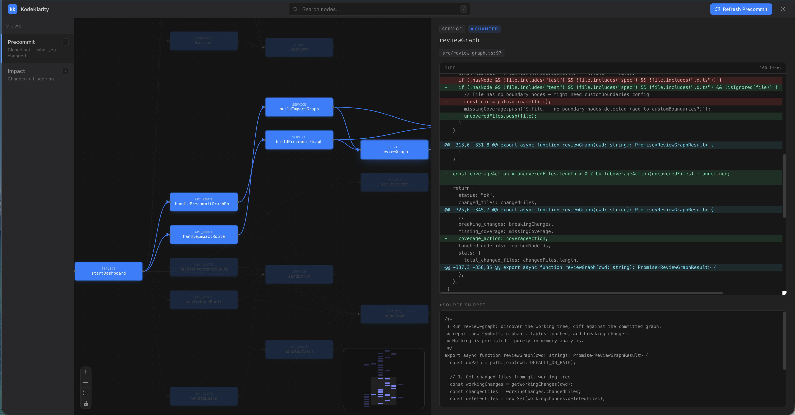

<div align="center">

# KodeKlarity

### Graph memory for coding agents.

*Memory that's pinned to your code, not to a model's interpretation of it. Plus the same graph tells your agent what each change is about to touch.*

[](#)
[](#)
[](#)
[](#)
[](./LICENSE)

</div>

<br>



```bash
npm install -g kodeklarity
cd your-project && kk init        # build the graph (5s, zero LLM cost)
kk dashboard                       # open the visibility layer
```

<br>

---

## Why graph memory

Every new session, your coding agent starts cold. The hard-won context about *why* `fetchUser` retries 3x, *why* this table can't be touched from the worker, *why* that auth middleware exists — gone.

The industry's answer is vector-based agent memory: hook into every tool call, auto-capture observations, run an LLM hourly to compress logs into summaries, embed everything, retrieve via vector + BM25 + reranker. It works for chat memory ("the user mentioned redis 40 turns ago"). It breaks the moment your code changes.

Because vector-based memory has no idea what the code *is*. Its anchors are text-similarity hashes. Rename a function and the memory floats free — confidently wrong, with no way to know.

**KodeKlarity takes the opposite approach.** Memory is pinned to nodes in a deterministic static graph of your codebase. A memory about `fetchUser` lives *on* that function. When the agent walks through it, the memory surfaces. And because the anchor is a code symbol — not a fuzzy embedding — refactor-aware behavior is something the design supports rather than fights: a re-anchor pass on rebuild can deterministically follow renames, flag truly orphaned memories as stale, and never silently corrupt the store *(shipping next — see Roadmap)*.

No LLM in the write or read path. No hooks capturing a firehose. No daemon. One SQLite file. Memory you can still trust six months from now.

And because we already have the graph, your agent gets impact analysis for free: *what does this change actually touch?*

<br>

---

## Pillar 1 — Visibility: see the ripple before you commit

Your AI agent edits five files. Tests pass. You commit.

What you didn't see: the background job that reads the same table, the three pages revalidating from that service, the API route serving the same data to mobile, the 145 callers downstream of the function it tweaked.

`grep` finds text. KodeKlarity finds **structural connections** — and shows you which ones your agent just touched.

### Precommit — the closed set

> *Exactly what you changed. Nothing more.*

The functions, routes, services, tables, and edges introduced or modified by your current diff. No callers, no callees. Use it to sanity-check: *am I touching what I think I'm touching?*

### Impact — the ripple

> *Changed nodes + everything one hop away.*

Same change set, expanded by a 1-hop ring of callers and callees. Use it before you commit: *what could break?* The dashboard renders this as a focused subgraph; click any node to see its diff and metadata.

<br>

---

## Pillar 2 — Memory: graph-anchored, durable, deterministic

Most agent-memory tools work like this: capture every tool call via hooks, run an LLM every hour to compress the firehose into summaries, embed everything, search via vector + BM25 + reranker. It's a lot of machinery to solve a problem that compounds: *the more you capture, the harder it is to find the few things that matter.*

KodeKlarity inverts the model:

- **Few, deliberate memories** — the agent writes only when there's something worth keeping. No auto-capture hooks. No noise.
- **Anchored to graph nodes** — a memory about `loginAction` lives *on* that function's node. When the agent traverses through that node, the memory surfaces automatically. No separate "recall" step.
- **No LLM in the write or read path** — deterministic, auditable, free. The agent decides what's worth writing; FTS5 + graph traversal handles retrieval.
- **The `memories` table is sacred.** Rebuilding the graph wipes `nodes` and `edges`; memories persist. This is the core invariant.

```bash
kk memory write "We retry 3x with backoff because the upstream API rate-limits at 100 rpm" \
  --symbol fetchUser --category gotcha
```

```bash
$ kk precommit --json
{
  "memories": [
    {
      "anchor": "fetchUser",
      "category": "gotcha",
      "content": "We retry 3x with backoff because..."
    }
  ],
  ...
}
```

The agent doesn't have to ask. When `kk precommit` walks the diff, memories pinned to touched nodes surface in the response.

### What about workflow / user memory?

A user-scoped memory tier (cross-project preferences, conventions) is on the roadmap — same table, new `scope` column. The principle holds: agents write deliberately, never on autopilot.

<br>

---

## Why trust matters more than features

Most agent-memory tools have impressive benchmark numbers — 95% R@5 on conversational chat benchmarks like LongMemEval. Useful when you want to know *"did the agent remember the user mentioned redis 40 turns ago."*

The relevant question for a coding agent is different: ***is this memory still true after my refactor?***

Vector-based stores can't answer that. Their anchors are text-similarity hashes, not symbols. Rename a function and the memory floats free — confidently wrong.

KodeKlarity's design makes a structurally different promise: because memories are pinned to graph nodes by stable symbol paths, **a refactor that renames a symbol can re-anchor the memory deterministically**. No LLM interpretation, no fuzzy match, no "trust me." That's the property the rest of the design protects.

<br>

---

## Built for AI agents — via the CLI they already have

Every coding agent has a Bash tool. That's all KodeKlarity needs.

No plugin to install per editor. No MCP server to configure. No agent-specific glue. **Every kk command takes `--json`** — output is structured, deterministic, sub-second, and works identically in Claude Code, Cursor, Codex, Cline, Windsurf, Aider, or anything else that can shell out.

Three modes the agent operates in:

**During work — exploratory lookups:**

```bash
kk impact updateUser --json --depth 2     # what breaks if I change this?
kk upstream requireAuth --json            # what calls this?
kk side-effects createOrder --json        # what writes/triggers/emits?
kk why --from createOrder --to users --json   # how are these connected?
```

**Before commit — the workflow gate (uncommitted changes):**

```bash
$ kk precommit --json
{
  "status": "ok",
  "changed_files": ["src/billing/refunds.ts", "src/jobs/email-queue.ts"],
  "new_symbols":   [...],
  "new_edges":     [...],
  "breaking_changes": [...],
  "tables_touched": { "writes": ["payments"], "reads": ["users", "orders"] },
  "orphans":       [],
  "missing_coverage": [...],
  "coverage_action": { ... },
  "memories":      [...],
  "stats":         { ... }
}
```

**Branch / PR review — the full diff since branch was created:**

```bash
$ kk review --base main --json
{
  "status": "ok",
  "diff_window": {
    "base_ref": "main",
    "merge_base": "bf02eec",
    "commits_on_branch": 3
  },
  "changed_files": [...],
  "new_symbols":   [...],
  "new_edges":     [...],
  "breaking_changes": [
    {
      "symbol": "updateUser",
      "kind": "action",
      "downstream_count": 12,
      "verdict": "signature_changed",
      "note": "signature changed — 12 downstream dependents (callers may break)"
    }
  ],
  "tables_touched": { ... },
  "orphans":       [...],
  "missing_coverage": [...],
  "coverage_action": { ... },
  "memories":      [...],
  "stats":         { ... }
}
```

`kk precommit` is the *uncommitted-only* gate. `kk review --base <ref>` is the *branch-level* report. Same field shape, identical parsing logic.

**No risk score, no synthetic numbers — the structural fields *are* the risk signals.** Agents read `breaking_changes`, `tables_touched.writes`, `orphans`, and `coverage_action` directly. Each `breaking_changes` entry includes an AST-level `verdict` (`signature_changed`, `removed_or_renamed`, `body_changed`) so the agent prioritizes — declarations that are textually unchanged are silently dropped (no file-granular noise).

<br>

### The agent loop (the part nobody else has)

KodeKlarity isn't just a dashboard — it's a **machine-readable contract for your agent**.

When `kk precommit --json` finds files in your diff without boundary nodes, the response includes a structured `coverage_action`:

```json
{
  "files": ["src/billing/refunds.ts", "src/jobs/email-queue.ts"],
  "next_steps": [
    "Add a customBoundary to .kodeklarity/config.json (real boundary)",
    "Or add the path to ignoreCoverage (entry/types/dispatch — not a boundary)",
    "Run kk init --force",
    "Re-run kk precommit until clean"
  ],
  "example_boundary": { ... }
}
```

Your agent reads this, edits `.kodeklarity/config.json`, runs `kk init --force`, and the graph permanently improves. **The graph self-corrects through the agent that uses it.**

<br>

---

## The CLI

Every command takes `--json` for agent consumption:

```bash
kk init                          # build the graph (5s, zero LLM cost)
kk rebuild                       # incremental update from git diff
kk precommit                     # uncommitted changes only — pre-commit gate
kk review --base main            # branch-level review — committed + uncommitted vs main
kk impact updateUser --depth 2   # what breaks if I change this symbol?
kk upstream requireAuth          # what calls this?
kk downstream createOrder        # what does this call?
kk side-effects createOrder      # what writes/triggers/emits?
kk why --from createOrder --to users   # how are these connected?
kk status                        # graph overview
kk search billing                # find nodes by name
kk memory write "..."            # agent-written notes attached to nodes
kk memory read --symbol fetchUser   # memories for a specific node
kk memory search "rate limit"    # FTS5 over all memories
kk dashboard                     # open the visibility layer in a browser
```

Telling your agent to run `kk precommit --json` before claiming done is a one-line addition to its rules file. Or paste the auto-generated `.kodeklarity/AGENTS.md` reference into your agent's system prompt — that file ships pre-loaded with the workflow.

<br>

---

## MCP (optional)

If your agent natively supports MCP (Claude Code, Cursor, Cline, Windsurf, etc.), KodeKlarity ships an MCP server — `kk-mcp` — that exposes the same commands as first-class tools (`kk_precommit`, `kk_impact`, `kk_rebuild`, `kk_memory_*`).

```jsonc
// e.g. ~/.claude/mcp.json
{
  "mcpServers": {
    "kodeklarity": { "command": "kk-mcp" }
  }
}
```

A small, stable surface — under 10 tools — by design. Tool selection accuracy drops as count grows.

<br>

---

## Dashboard (for humans)

```bash
kk dashboard
```

Local web UI on `http://127.0.0.1:4421`. Two-pane layout (graph + diff), resizable inspector, search-and-filter, light/dark theme, keyboard shortcuts (`R` refresh, `1`/`2` switch views, `/` search, `?` help). Same data the CLI returns — rendered for clicking. Bound to localhost only, no telemetry, no remote calls.

<br>

---

## Get started

```bash
# 1. Install
npm install -g kodeklarity

# 2. Build the graph for your project (5s, zero LLM cost)
cd your-project
kk init
```

That's the whole setup.

**Tell your agent to use it** — paste a `@.kodeklarity/AGENTS.md` reference into your agent's rules / system prompt. That file is auto-generated by `kk init` and tells the agent the workflow: use `kk impact / upstream / side-effects` to reason about what it's touching, run `kk precommit --json` before claiming done, decide on any `coverage_action` issues, write memories on non-obvious decisions.

<br>

---

## What it catches

Every `kk precommit --json` and `kk review --base <ref> --json` returns the same structured report:

| Signal | What it means |
|---|---|
| `new_symbols` | Functions, routes, services your diff introduces |
| `new_edges` | Calls / imports / writes / triggers connecting them |
| `breaking_changes` | Existing nodes whose **declaration actually changed** at the AST level. Each entry has a `verdict`: `signature_changed` (high signal), `removed_or_renamed` (high), `body_changed` (medium). Symbols whose text is unchanged are dropped. |
| `tables_touched.writes` / `.reads` | DB tables your changes hit, by direction |
| `orphans` | New code that nothing calls — wired up wrong, or dead |
| `missing_coverage` + `coverage_action` | Diff files with no boundary nodes — agent fixes via customBoundary or ignoreCoverage |
| `memories` | Auto-surfaced agent notes anchored to touched nodes |
| `diff_window` (review only) | Merge-base SHA + commit count |

Each non-empty field is itself a risk signal — no synthetic score. Agents prioritize by reading the structural fields directly.

<br>

---

## Under the hood

- **Pure static analysis. Zero LLM calls in the core path.** Predictable cost (free), predictable latency (sub-second queries), deterministic output. Run it 1,000 times on the same input, get the same output.
- **Symbol-level accuracy.** TypeScript's `ts.createProgram` for type-aware tracing — finds connections `grep` will never see (re-exports, aliased imports, dynamic dispatch flagged explicitly as gaps).
- **AST-level diff for `breaking_changes`.** For each candidate, kk parses both the merge-base version (`git show <ref>:<file>`) and the working-tree version, normalizes whitespace, and tags each entry with a verdict. Eliminates 80–90% of noise on real diffs.
- **One local SQLite file + FTS5.** Graph and memory live at `.kodeklarity/index/`. No daemon, no ports, no telemetry. Never leaves your machine.
- **The `memories` invariant.** Rebuilding the graph wipes `nodes` and `edges` — the `memories` table is sacred. Any migration touching storage must preserve this.

<br>

---

## How it compares

|  | KodeKlarity | Vector-based agent memory | `grep` / IDE search |
|---|---|---|---|
| Captures | Deliberate notes the agent writes | Every tool call via hooks | N/A |
| Anchor | Stable symbol paths in the code graph | Text-similarity embeddings | None |
| Retrieval | Graph traversal + FTS5 | BM25 + vector + reranker | Substring match |
| LLM in core path | None | Required for compression | None |
| Cost | Free | Token spend per consolidation | Free |
| Survives refactors | Designed for it | Drifts silently | N/A |
| Operational footprint | One SQLite file | Daemon + ports + dashboard | None |
| Tool surface | < 10 MCP tools | 40-50+ MCP tools |  N/A |

Different products for different problems. If you want a chat-memory store for general agent activity, vector-based tools are reasonable. If you want code intelligence and durable annotations on that code, KodeKlarity is built for it.

<br>

---

## Framework support

**TypeScript ecosystem only (v1).** Each adapter understands framework-specific patterns that generic tools miss.

### Fully supported & tested
| Framework | What it discovers |
|---|---|
| **Next.js** | Pages, API routes, server actions, middleware, layouts, `revalidatePath` / `revalidateTag` edges |
| **Drizzle ORM** | Tables (`pgTable`/`sqliteTable`), RLS policies, `db.select/insert/update/delete`, relations |
| **Trigger.dev** | Tasks, jobs |

### Adapters built, fixtures in progress
NestJS · Express · React (standalone) · generic patterns (`fetch`, event emitters)

### Planned — community contributions welcome
Prisma · tRPC · Hono · Elysia · Supabase · Clerk / Auth.js · GraphQL · Fastify

**Monorepos:** Turborepo, Nx, pnpm workspaces, npm workspaces — all supported with cross-workspace import resolution.

<br>

---

## Why agents shape it themselves

KodeKlarity has no human-tuned config out of the box. The way you (or your agent) extend it:

```json
// .kodeklarity/config.json
{
  "customBoundaries": [
    {
      "name": "billing_service",
      "kind": "service",
      "glob": "src/billing/**/*.ts",
      "symbolPattern": "^export\\s+(async\\s+)?function\\s+",
      "reason": "Billing service layer"
    }
  ],
  "ignoreCoverage": [
    "src/cli.js",
    "src/types.ts",
    "src/main.tsx"
  ]
}
```

When `kk precommit` reports `coverage_action`, the agent decides per file: real boundary → `customBoundaries`, intentional non-boundary → `ignoreCoverage`. Run `kk init --force`, re-run, until clean. The graph compounds across sessions because *the agent maintains it*.

<br>

---

## Roadmap

- **Refactor-survival memory** — deterministic re-anchor pass on every rebuild. Memories whose symbol was renamed get auto-followed; memories whose anchor is gone get flagged stale (never silently deleted). New `kk_memory_list_stale` MCP tool so agents can surface and repair.
- **Scoped memory tiers** — `code` (existing, anchored), `project` (existing, un-anchored), `user` (cross-project preferences), `session` (ephemeral).
- **Refactor-drift benchmark** — public dataset + harness. Apply 6 mutation classes to real OSS TS repos; measure how memory systems hold up across renames, moves, signature changes, deletions.
- **LongMemEval-S baseline** — published number for cross-comparison with the broader agent-memory field.

<br>

---

## Contributing

New framework adapters are the highest-leverage contribution. Each one is a single TypeScript file (~100–200 lines) that teaches `kk` about a framework's patterns. See `src/discover/adapters/` for examples and `CONTRIBUTING.md` (or open an issue) for the workflow.

<br>

---

## License

AGPL-3.0. Free for personal use, internal company use, and open-source projects. If you build a competing hosted product, talk to us.
